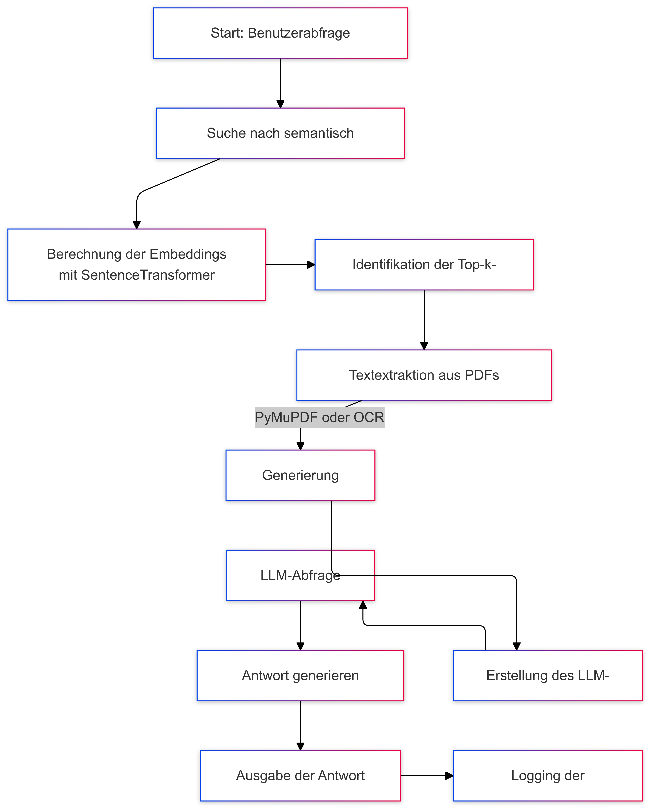

Hier ist die Dokumentation mit einer Beschreibung und einem Mermaid-Datenflussdiagramm:

---

# **Dokumentation: Dokumentenmanagement und LLM-Abfragen**

Dieses Skript ermöglicht:
1. **Dokumentensuche**: Durchsucht PDFs basierend auf einer Anfrage, die in semantische Embeddings umgewandelt wird.
2. **Textextraktion**: Extrahiert Text aus PDFs und, falls nötig, mit OCR.
3. **Kontextgenerierung**: Liefert kontextbasierte Informationen für eine Anfrage.
4. **LLM-Integration**: Verwendet ein Sprachmodell (GPT) zur Beantwortung von Fragen basierend auf den extrahierten Informationen.

---

## **Datenflussbeschreibung**

1. **Benutzerabfrage**:
   - Eine Abfrage des Benutzers wird entgegengenommen.
   - Es erfolgt eine Suche nach den ähnlichsten Dokumenten mithilfe von Faiss.

2. **Dokumentensuche**:
   - Die semantische Ähnlichkeit wird berechnet, und die k relevantesten Dokumente werden identifiziert.

3. **Textextraktion**:
   - Volltext wird aus den relevanten PDFs extrahiert (mit PyMuPDF oder OCR, falls nötig).
   - Der Kontext wird aus den Dokumenten generiert.

4. **LLM-Abfrage**:
   - Der generierte Kontext und die Benutzerabfrage werden an das LLM gesendet.
   - Das LLM gibt eine Antwort basierend auf dem Kontext zurück.

5. **Ausgabe**:
   - Die Antwort wird zurückgegeben und geloggt.

---

## **Mermaid-Datenflussdiagramm**

---

## **Hauptfunktionen**

### **`suche(query_text, k=5)`**
- Sucht die k relevantesten Dokumente basierend auf der Benutzerabfrage.
- **Eingabe**: Text der Abfrage.
- **Ausgabe**: Liste relevanter Dokumente mit Ähnlichkeitswerten.

### **`extract_full_text_from_pdf(file_path)`**
- Extrahiert den gesamten Text aus einer PDF-Datei.
- **Eingabe**: Dateipfad.
- **Ausgabe**: Volltext des Dokuments.

### **`query_llm(user_query, context)`**
- Sendet die Benutzerabfrage und den Kontext an das LLM.
- **Eingabe**: Benutzerabfrage und Kontext.
- **Ausgabe**: Antwort des LLM.

### **`answer_query(user_query, k=5)`**
- Gesamtprozess: Suchen, Kontext generieren, und LLM-Abfrage.
- **Eingabe**: Benutzerabfrage.
- **Ausgabe**: Antwort des LLM.

---

## **Beispielausführung**

- **Benutzerabfrage**: "Zeige den Inhalt."
- **Antwort**: Generierte Antwort basierend auf den extrahierten Texten und dem Kontext.

---

## **Voraussetzungen**

- `faiss`, `sentence_transformers`, `PyMuPDF`, `pytesseract`, `Pillow`
- OpenAI-API-Schlüssel für LLM-Abfragen.

---

Falls weitere Anpassungen benötigt werden, lass es mich wissen! 😊