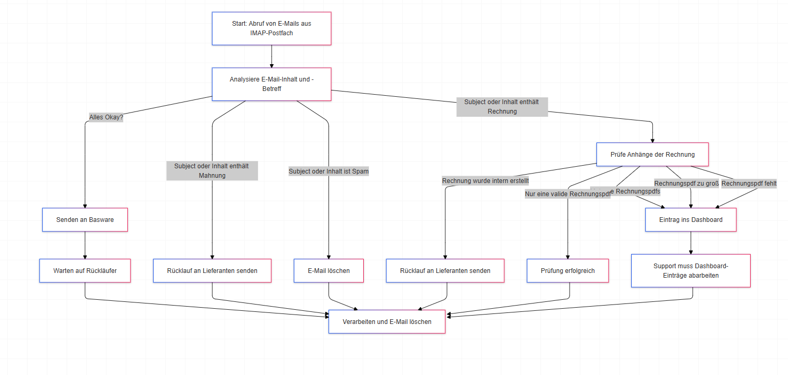

### **Präsentation des Workflows: E-Mail-Verarbeitungssystem**

Das folgende Dokument beschreibt den Workflow eines Programms, das E-Mails aus einem IMAP-Postfach verarbeitet. Die verschiedenen Workflows basieren auf dem Betreff und dem Inhalt der E-Mail.

---

### **Schritte des Programms**

1. **E-Mail-Abruf**:
   - Das System ruft E-Mails aus einem definierten IMAP-Postfach ab und verarbeitet Multipart-Inhalte.

2. **E-Mail-Analyse**:
   - Jede E-Mail wird analysiert, um basierend auf ihrem Betreff oder Inhalt Workflows auszulösen.

3. **Workflows**:
   - **Mahnung**: Rücklauf an den Lieferanten senden.
   - **Rechnung**:
     - Bei mehreren Rechnungspdfs: Eintrag ins Dashboard.
     - Bei einer Rechnungspdf, die zu groß ist: Eintrag ins Dashboard.
     - Bei fehlender Rechnungspdf: Eintrag ins Dashboard.
     - Wenn die Rechnung intern erstellt wurde: Rücklauf an den Lieferanten.
   - **Spam**: Die E-Mail wird gelöscht.
   - **Alles Okay?**: Senden an Basware, auf Rückläufer warten, verarbeiten und löschen.

4. **Dashboard-Einträge**:
   - Alle Einträge im Dashboard müssen manuell vom Support-Team abgearbeitet werden.

---

### **Mermaid Dataflow Diagram**

---
### **Details zu den Workflows**

#### **1. Workflow: Mahnung**
   - **Kriterium**: Betreff oder Inhalt der E-Mail enthält „Mahnung“.
   - **Aktion**: Sende eine Rücklauf-E-Mail an den Lieferanten.

#### **2. Workflow: Rechnung**
   - **Kriterium**: Betreff oder Inhalt der E-Mail enthält „Rechnung“.
   - **Mögliche Szenarien**:
     1. Mehrere Rechnungspdfs: Eintrag ins Dashboard.
     2. Eine Rechnungspdf zu groß: Eintrag ins Dashboard.
     3. Rechnungspdf fehlt: Eintrag ins Dashboard.
     4. Rechnung wurde intern erstellt: Rücklauf an den Lieferanten.
     5. Nur eine valide Rechnungspdf: Weiter zur Prüfung und Verarbeitung.

#### **3. Workflow: Spam**
   - **Kriterium**: Betreff oder Inhalt der E-Mail deutet auf Spam hin.
   - **Aktion**: Die E-Mail wird gelöscht.

#### **4. Workflow: Alles Okay?**
   - **Kriterium**: E-Mail enthält valide Daten.
   - **Aktion**:
     1. Senden an Basware.
     2. Auf Rückläufer warten.
     3. Rückläufer verarbeiten.
     4. E-Mail löschen.

#### **5. Dashboard-Einträge**
   - Alle Einträge im Dashboard müssen manuell vom Support-Team bearbeitet werden.

---

### **Zusammenfassung**

Das System automatisiert die Verarbeitung von E-Mails, erkennt verschiedene Arten von Inhalten und steuert die Workflows entsprechend. Durch die Integration eines Dashboards können komplexe Fälle vom Support-Team bearbeitet werden, während Routineaufgaben automatisiert ablaufen.