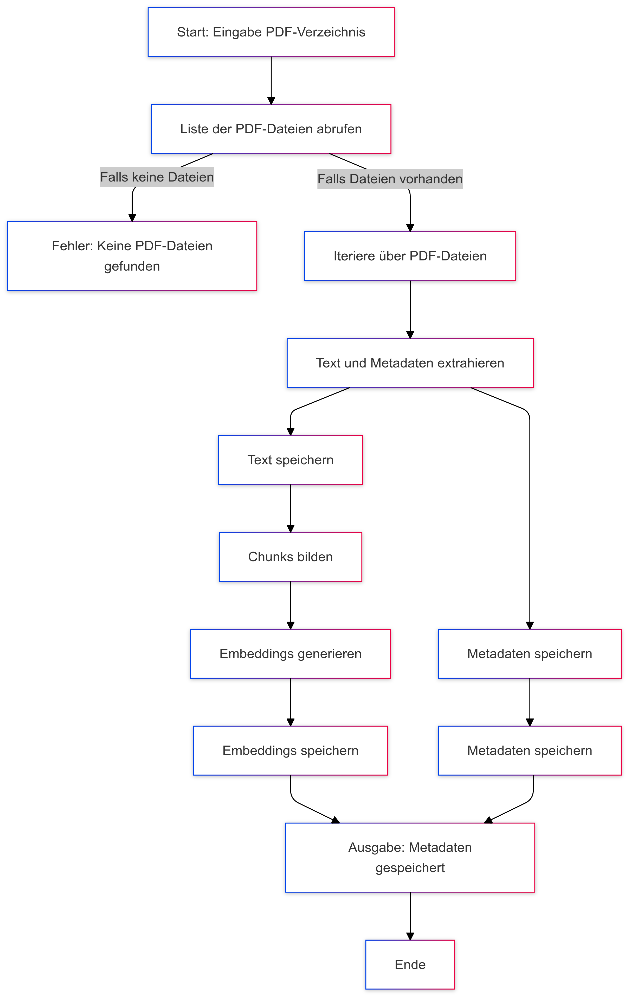

# Datenfluss des PDF-Verarbeitungsskripts

## Beschreibung des Datenflusses

1. **Eingabe**:
   - Der Benutzer gibt das PDF-Verzeichnis und optional Ausgabedateinamen über die Kommandozeile an.
   - Das Skript prüft, ob PDF-Dateien im Verzeichnis vorhanden sind.

2. **PDF-Verarbeitung**:
   - Für jede Datei im Verzeichnis wird der Text und die Metadaten extrahiert:
     - **Metadaten**: Dateiname, Dateipfad, Erstellungsdatum, Änderungsdatum, Dateigröße, Seitenanzahl, PDF-Metadaten.
     - **Text**: Der gesamte Text der PDF-Datei wird verarbeitet, mit der ersten nicht leeren Zeile als Titel.

3. **Embeddings**:
   - Der extrahierte Text wird in Chunks verarbeitet, und Embeddings werden mithilfe von `SentenceTransformer` generiert.

4. **Speicherung**:
   - Die Embeddings und Metadaten werden als Pickle-Dateien gespeichert.

5. **Ausgabe**:
   - Fortschritt und Erfolgsmeldungen werden in der Konsole ausgegeben.

---

## Datenflussdiagramm

## Zusammenfassung

Das Skript verarbeitet die Dateien in einer sequentiellen Pipeline, bei der jede Datei analysiert wird. Embeddings und Metadaten werden separat generiert und gespeichert. Die Benutzerinteraktion erfolgt über Fortschrittsanzeigen und Konsolenmeldungen.

Dieses Diagramm visualisiert die einzelnen Schritte von der Eingabe bis zur Speicherung und ist hilfreich, um den Workflow zu verstehen.
