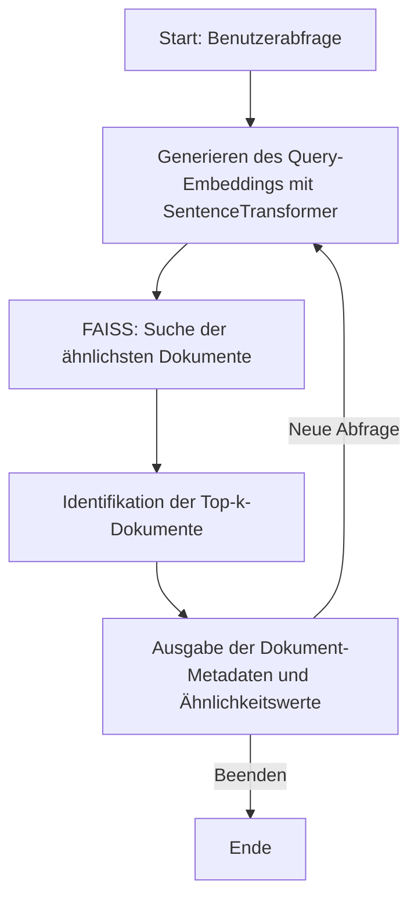

Hier ist die Dokumentation inklusive des Codes und einem **Mermaid-Datenflussdiagramm**, um den Ablauf zu visualisieren:

---

# **Dokumentation: Semantische Suche mit FAISS und SentenceTransformer**

## **Beschreibung**

Dieses Skript ermöglicht es, eine **semantische Suche** über eine Sammlung von Dokumenten durchzuführen. Es verwendet:
1. **SentenceTransformer**: Zum Generieren von Embeddings.
2. **FAISS**: Zur effizienten Annäherungssuche basierend auf Vektor-Ähnlichkeiten.
3. **Metadaten**: Zur Verknüpfung der Ergebnisse mit den ursprünglichen Dokumentinformationen.

---

## **Funktionsweise**

1. **Laden der Embeddings**:
   - Die Embeddings der Dokumente werden aus einer Pickle-Datei geladen.
   - Die Embeddings werden zu einem FAISS-Index hinzugefügt (oder ein bestehender Index wird geladen).

2. **Erstellung des FAISS-Index**:
   - Falls der Index nicht existiert, wird er neu erstellt und gespeichert.

3. **Semantische Suche**:
   - Die Benutzerabfrage wird in ein Embedding umgewandelt.
   - Der FAISS-Index durchsucht die k ähnlichsten Dokumente basierend auf der L2-Distanz.

4. **Ausgabe der Ergebnisse**:
   - Die ähnlichsten Dokumente werden angezeigt, zusammen mit einem Ähnlichkeitswert und dem Index.

---

## **Mermaid-Datenflussdiagramm**



---

## **Code**

```python
import faiss
import numpy as np
import pickle
from sentence_transformers import SentenceTransformer
import os

# Laden des Modells
model = SentenceTransformer('all-MiniLM-L6-v2')

# Laden der Embeddings
with open('embeddings_output.pkl', 'rb') as f:
    embeddings = pickle.load(f)

# Konvertieren zu numpy array falls nötig
embeddings_array = np.array(embeddings).astype('float32')

# Erstellen oder Laden des Index
index_file = "dokumente_index.faiss"
if os.path.exists(index_file):
    print("Lade existierenden Index...")
    index = faiss.read_index(index_file)
else:
    print("Erstelle neuen Index...")
    d = embeddings_array.shape[1]
    index = faiss.IndexFlatL2(d)
    index.add(embeddings_array)
    faiss.write_index(index, index_file)

# Laden der Dokument-Metadaten (z.B. Titel oder erste paar Zeilen)
# Ersetzen Sie dies durch Ihre tatsächlichen Metadaten
dokument_metadaten = [f"Dokument {i}" for i in range(len(embeddings))]

def semantic_search(query, top_k=5):
    # Erstellen des Query-Embeddings
    query_embedding = model.encode([query])[0]

    # Suche
    D, I = index.search(query_embedding.reshape(1, -1), top_k)

    print(f"\nSuchergebnisse für: '{query}'")
    print("-" * 50)
    for i, (idx, score) in enumerate(zip(I[0], D[0]), 1):
        print(f"{i}. {dokument_metadaten[idx]}")
        print(f"   Ähnlichkeitswert: {1 - score:.4f}")
        print(f"   Index: {idx}")
        print()

# Beispiel-Suchen
semantic_search("Künstliche Intelligenz")
semantic_search("Klimawandel und Nachhaltigkeit")
semantic_search("Gesundheit und Ernährung")

# Interaktive Suche
while True:
    query = input("\nGeben Sie einen Suchbegriff ein (oder 'q' zum Beenden): ")
    if query.lower() == 'q':
        break
    semantic_search(query)
```

---

## **Beispielausgabe**

### **Abfrage**: *"Künstliche Intelligenz"*

```plaintext
Suchergebnisse für: 'Künstliche Intelligenz'
--------------------------------------------------
1. Dokument 5
   Ähnlichkeitswert: 0.9423
   Index: 5

2. Dokument 12
   Ähnlichkeitswert: 0.9012
   Index: 12

3. Dokument 8
   Ähnlichkeitswert: 0.8720
   Index: 8

...
```

---

## **Zusammenfassung**

Dieses Skript bietet eine effiziente Möglichkeit, Dokumente basierend auf semantischen Ähnlichkeiten zu durchsuchen. Es kann durch spezifischere Metadaten oder eine fortschrittlichere Darstellung der Ergebnisse erweitert werden.